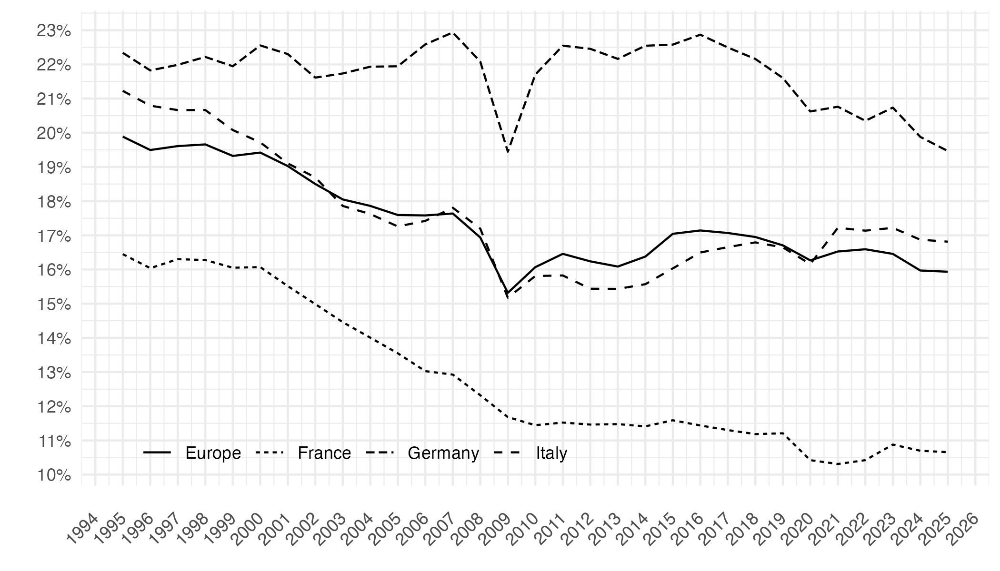
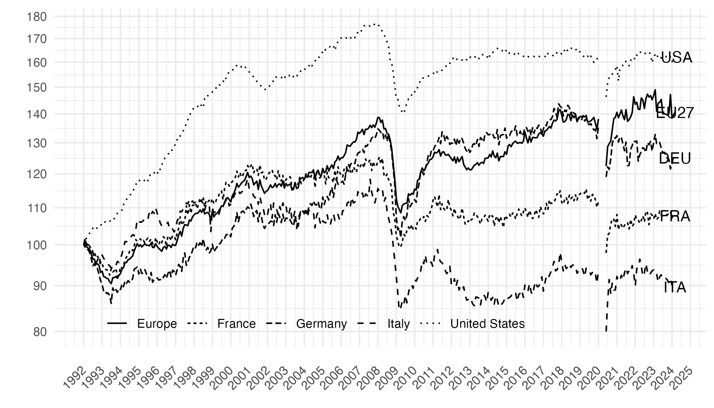
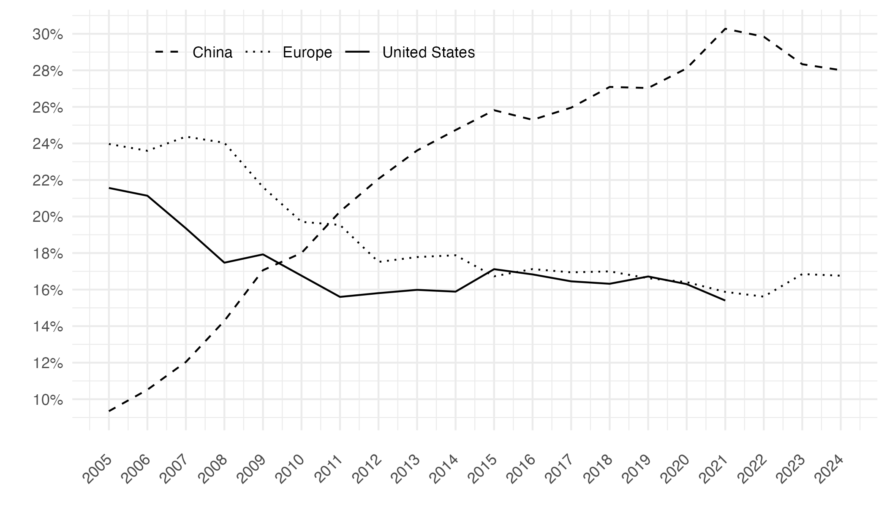

# Reindustrialisation: the European Union and the nations

This repository provides replication codes for the charts of the chapter in the European Economy 2025 "Reindustrialisation: the European Union and the nations".

## Chart 1: Manufacturing value added (% of GDP)

[R Code](figure1.R)

## Chart 2: Industrial production index (index 100 = January 1992)

[R Code](figure2.R)

## Chart 3: Manufacturing value added (% of world VA)

[R Code](figure3.R)

